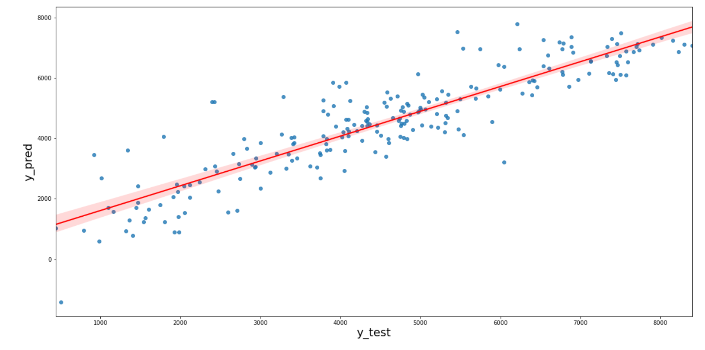

# BikeSharingAssignment
 build a multiple linear regression model for the prediction of demand for shared bikes. 

## Table of Contents
* [General Info](#general-information)
* [Technologies Used](#technologies-used)
* [Conclusions](#conclusions)
* [Acknowledgements](#acknowledgements)

# Bike Sharing Demand Prediction

# General Information

## Problem Statement

A bike-sharing system provides bicycles for shared use on a short-term basis, either for a fee or free of charge. Many such systems utilize computer-controlled "docks," where users input payment information to unlock a bike. The bike can then be returned to any dock within the same system.

BoomBikes, a US-based bike-sharing provider, has faced significant revenue declines due to the COVID-19 pandemic. To recover quickly and thrive once the lockdown is lifted and the economy stabilizes, BoomBikes aims to devise a strategic business plan. 

The company is focused on understanding the factors influencing the demand for shared bikes post-pandemic. By doing so, they aim to anticipate customer needs, outpace competitors, and maximize profits. BoomBikes has partnered with a consulting firm to analyze these factors.

### Key Questions

1. Which variables significantly influence the demand for shared bikes?  
2. How effectively do these variables explain variations in bike demand?  

Using data gathered from meteorological surveys and customer behavior trends, BoomBikes has compiled a dataset of daily bike demand across the American market. This dataset serves as the foundation for analysis and strategy development.

---

## Business Goal

The objective is to model the demand for shared bikes using the provided independent variables. This model will help management understand how bike demand varies with different factors. Consequently, BoomBikes can manipulate business strategies to meet demand levels and customer expectations. The model will also aid in understanding demand dynamics in new markets.

---

## Dataset Information

- **casual**: Number of casual users making rentals.  
- **registered**: Number of registered users making rentals.  
- **cnt**: Total number of bike rentals (target variable), including both casual and registered users.  

---
# Tecehnologies Used: 

# Libraries Used

### 1. **pandas**
   - A powerful Python library used for data manipulation and analysis.
   - Provides data structures like `DataFrame` and `Series` for handling and analyzing structured data effectively.
   - **Documentation:** [pandas](https://pandas.pydata.org/)

### 2. **numpy**
   - A fundamental library for numerical computations in Python.
   - Supports multi-dimensional arrays and a variety of mathematical functions for array manipulation.
   - **Documentation:** [NumPy](https://numpy.org/)

### 3. **matplotlib.pyplot**
   - A plotting library for creating static, interactive, and animated visualizations in Python.
   - `pyplot` is a module in `matplotlib` used for plotting graphs and visualizing data.
   - **Documentation:** [Matplotlib](https://matplotlib.org/)

### 4. **seaborn**
   - A Python library built on `matplotlib` for making statistical data visualization more attractive and informative.
   - Provides built-in themes, color palettes, and functions for complex visualizations like heatmaps and violin plots.
   - **Documentation:** [Seaborn](https://seaborn.pydata.org/)

### 5. **calendar**
   - A built-in Python module that provides functions for working with dates and calendars.
   - Useful for handling month names, weekdays, and generating calendar-based data.
   - **Documentation:** [Calendar](https://docs.python.org/3/library/calendar.html)

---

## Regression Libraries

### 6. **sklearn.model_selection.train_test_split**
   - Splits datasets into training and testing subsets for model evaluation.
   - A key tool for ensuring unbiased testing of machine learning models.
   - **Documentation:** [train_test_split](https://scikit-learn.org/stable/modules/generated/sklearn.model_selection.train_test_split.html)

### 7. **sklearn.preprocessing.MinMaxScaler**
   - A normalization tool that scales features to a specified range (default: 0 to 1).
   - Helps improve the performance and convergence of machine learning models.
   - **Documentation:** [MinMaxScaler](https://scikit-learn.org/stable/modules/generated/sklearn.preprocessing.MinMaxScaler.html)

### 8. **sklearn.feature_selection.RFE**
   - Recursive Feature Elimination (RFE) is a method for feature selection.
   - Fits a model and eliminates less important features iteratively to find the most significant predictors.
   - **Documentation:** [RFE](https://scikit-learn.org/stable/modules/generated/sklearn.feature_selection.RFE.html)

### 9. **sklearn.linear_model.LinearRegression**
   - A linear approach for modeling the relationship between a dependent variable and one or more independent variables.
   - Used for building regression models in machine learning.
   - **Documentation:** [LinearRegression](https://scikit-learn.org/stable/modules/generated/sklearn.linear_model.LinearRegression.html)

### 10. **sklearn.metrics.r2_score & mean_squared_error**
   - `r2_score`: Measures how well the predicted values match the actual values in a regression model.
   - `mean_squared_error`: Calculates the average squared difference between the predicted and actual values.
   - **Documentation:** [Metrics](https://scikit-learn.org/stable/modules/classes.html#module-sklearn.metrics)

---

## Statistical Analysis

### 11. **statsmodels.api**
   - A Python library for estimating and testing statistical models.
   - Provides detailed output for linear regression, time series analysis, and hypothesis testing.
   - **Documentation:** [Statsmodels](https://www.statsmodels.org/)

### 12. **statsmodels.stats.outliers_influence.variance_inflation_factor**
   - Computes Variance Inflation Factor (VIF) to detect multicollinearity in regression models.
   - Helps identify features with high correlation to avoid redundancy in predictors.
   - **Documentation:** [VIF](https://www.statsmodels.org/stable/generated/statsmodels.stats.outliers_influence.variance_inflation_factor.html)

## Steps Taken

1. **Data Understanding and Cleaning**
   - Read and explored the dataset.

2. **Exploratory Data Analysis (EDA)**
   - Univariate analysis
   - Bivariate analysis
   - Multivariate analysis

3. **Data Preparation**
   - Train-test split
   - Rescaling variables
   - Checking Variance Inflation Factor (VIF)
   - One-hot encoding

4. **Model Building**
   - Feature scaling
   - Training the model using `LinearRegression` from `sklearn.linear_model`

5. **Residual Analysis**
   - Homoscedasticity
   - Linearity validation

6. **Model Evaluation**
   - R² and Adjusted R² calculation
   - Visualizing the model
   - Deriving the equation for the best-fit line

---

## Conclusion

### Positive Factors:
1. **Temperature (temp):**  
   - A unit increase in temperature results in a **+4122.11** increase in bike bookings.  
   - Warmer temperatures have a strong positive correlation with bike usage.  

2. **Year (yr):**  
   - A unit increase in year results in a **+2044.85** increase in bike bookings.  
   - Reflects a positive trend in bike rental popularity over time.  

3. **September:**  
   - September shows a strong positive correlation with bike bookings, likely due to favorable weather and increased popularity.  

### Negative Factors:
1. **Bad Weather (3):**  
   - Bad weather conditions (e.g., heavy rain, thunderstorms, snow) lead to a **-2491.068** decrease in bike bookings.  

2. **Winter:**  
   - Holidays and colder months see decreased demand due to unfavorable weather conditions.  

---

## Model Equation

The final model for predicting bike demand:

cnt = 1858.811 + (yr * 2044.850) - (holiday * 816.386) + (temp * 4122.114) - (windspeed * 1363.530) - (spring * 531.807) + (summer * 380.496) + (winter * 668.806) - (january * 333.645) - (july * 443.581) + (september * 660.234) + (sunday * 172.032) - (2 * 694.085) - (3 * 2491.068)

---

## Overall Analysis

Bike demand is influenced by the following factors:

- **Positive Influences:**
  - Warmer temperatures during summer.
  - The month of September.
  - Increasing popularity of bike rentals over time.

- **Negative Influences:**
  - Bad weather (e.g., rain, thunderstorms, snow).
  - Winter holidays and colder months.

By leveraging these insights, BoomBikes can adjust its strategies to meet customer demands effectively and maximize revenue.

## Model Visualization

The graph below shows the predicted bike demand vs. the actual bike demand:

